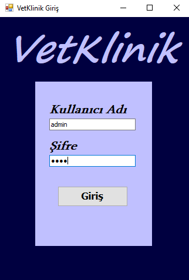
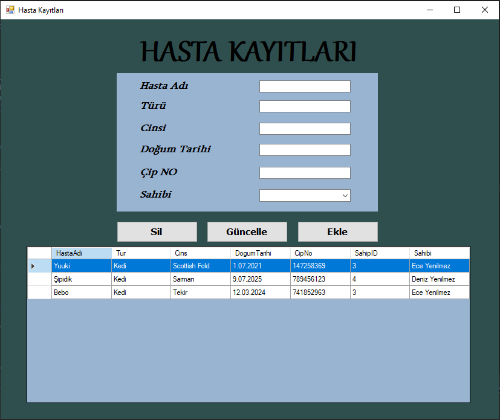
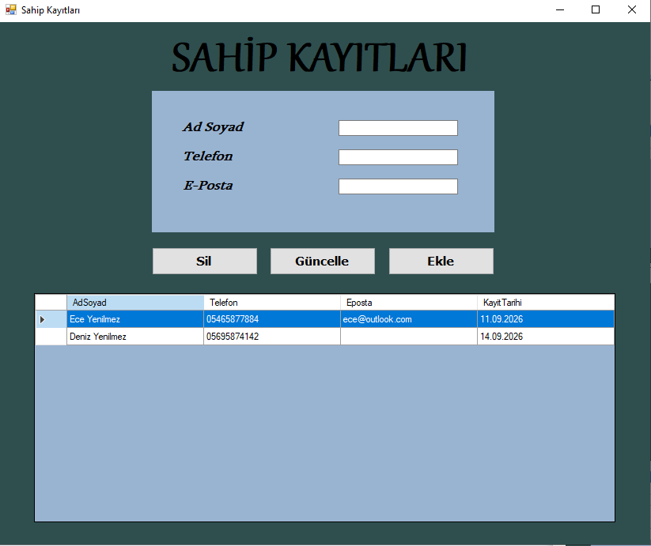
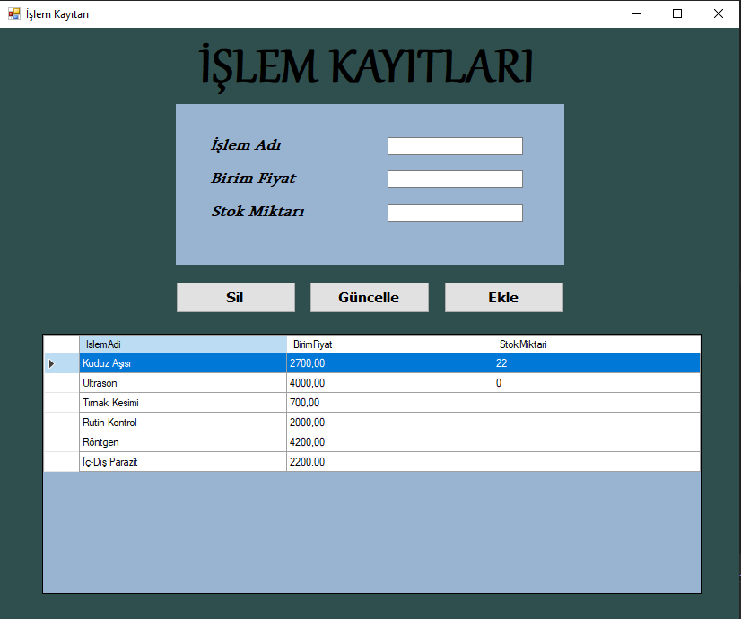
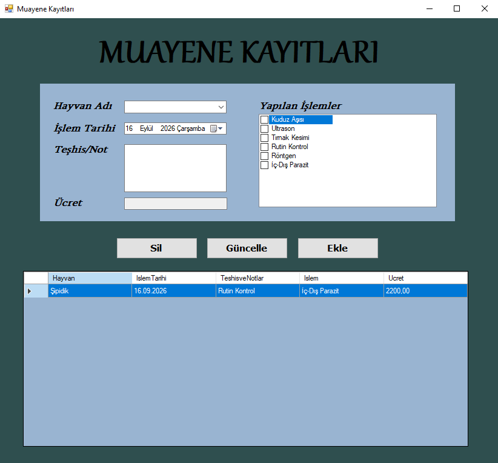
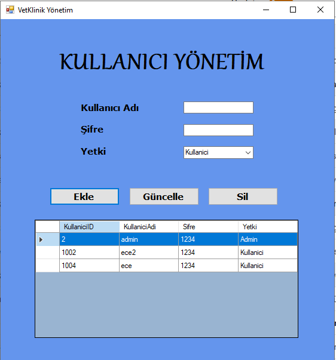

# 🐾 VetKlinik

VetKlinik is a desktop application developed to manage veterinary clinic records in a simple and organized way.

The application allows clinic staff to manage animals, owners, examinations, operations, and user accounts through a Windows Forms interface.

## 📌 About the Project

VetKlinik was developed as an internship project using C# and Windows Forms.

The main goal of the project is to provide a centralized system for managing veterinary clinic records and performing common operations such as adding, updating, listing, and deleting records.

## ✨ Features

- 🐾 Animal management
- 👤 Owner management
- 🩺 Examination record management
- 💊 Operation management
- 🔐 User login and authorization
- 👑 Admin management panel
- 🔄 CRUD operations
- ✅ Input validation
- 🔗 Animal-owner relationships
- 🔗 Examination-operation relationships
- 💰 Automatic examination fee calculation

## 🛠️ Technologies

- C#
- Windows Forms
- .NET Framework 4.7.2
- Entity Framework 6
- SQL Server
- LINQ
- EDMX
- Database First approach

## 🏗️ Project Structure

The application follows a simple layered structure:

```text
Windows Forms
      ↓
ValidasyonYoneticisi
      ↓
VeriYoneticisi
      ↓
Entity Framework 6
      ↓
SQL Server
```

### VeriYoneticisi

`VeriYoneticisi` is responsible for database operations.

It contains methods for:

- Creating records
- Reading records
- Updating records
- Deleting records
- Checking existing records
- User login operations

This keeps database-related operations in one central class.

### ValidasyonYoneticisi

`ValidasyonYoneticisi` handles validation rules before database operations are performed.

Examples include:

- Required field checks
- Duplicate chip number checks
- Duplicate phone number checks
- Valid animal selection for examinations
- Examination fee validation
- Operation selection validation
- User validation

## 🗄️ Database Structure

The main entities used in the project are:

- `TblHayvanlar`
- `TblSahipler`
- `TblMuayeneKayitlari`
- `TblIslemler`
- `TblKullanicilar`
- `TblHastaSahipleri`
- `TblMuayeneIslemleri`

### Relationships

- Animals ↔ Owners → Many-to-Many
- Animals → Examinations → One-to-Many
- Examinations ↔ Operations → Many-to-Many

Many-to-many relationships are handled through:

- `TblHastaSahipleri`
- `TblMuayeneIslemleri`

## 🔐 Authorization

The application has two user roles:

### Admin

Administrators can access the user management panel and manage user accounts.

### User

Regular users can access the main veterinary clinic application.

The authorization system uses the `Yetki` field in `TblKullanicilar`.

The system also prevents the last administrator account from being deleted.

## 🩺 Examination Management

The examination module allows users to:

1. Select an animal.
2. Select one or more operations.
3. Enter diagnosis and notes.
4. Calculate the examination fee.
5. Save the examination record.

The selected operations are stored in `TblMuayeneIslemleri`, which connects examinations with operations.

## 🔄 CRUD Operations

The application supports standard CRUD operations:

- **Create** – Add new records
- **Read** – List existing records
- **Update** – Modify records
- **Delete** – Remove records

CRUD functionality is implemented for the main entities of the application.

## 🖥️ Application Screens

### 🔑 Login



### 🏠 Main Page


### 🐾 Animal Management



### 👤 Owner Management



### 💊 Operation Management



### 🩺 Examination Management



### 👑 Admin Panel



## 🚀 Getting Started

### Requirements

- Visual Studio
- .NET Framework 4.7.2
- SQL Server / SQL Server LocalDB
- Entity Framework 6

### Installation

1. Clone the repository.
2. Open `VetKlinik.slnx` with Visual Studio.
3. Configure the database connection in `App.config`.
4. Make sure the required database is available.
5. Build and run the project.

> **Note:** Database connection settings may need to be configured according to your local environment.

## 📚 Project Purpose

This project was developed as an internship project to gain practical experience with:

- C# programming
- Windows Forms development
- Entity Framework
- Database management
- CRUD operations
- LINQ
- Validation
- User authorization
- Relational database design

## 👩‍💻 Developer

**Ece Yenilmez**

## 📄 License

This project was developed for educational and internship purposes.

## 📄 License

This project was developed for educational and internship purposes.
